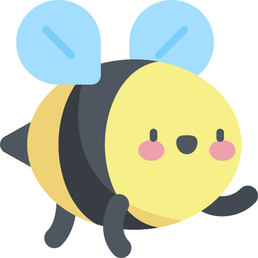
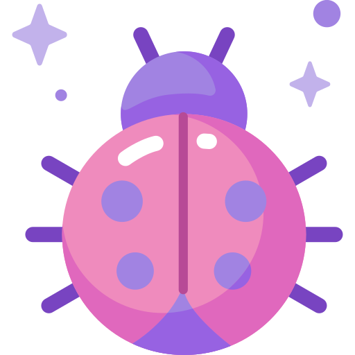

    
    

#  About me

### _I am a QA Engineer_ 

I have over 4 years of experience in testing web applications and quality assurance. I regularly pursue further education in the field of testing, studying new technologies and improving my skills.

 

##  My projects

    
    
    
    
    

    

##  Technology stack

    
    
    
    
    
    
    
    
    
     
    
    
    
    
    
    
    

 

##  GitHub statistics

    &nbsp;
    &nbsp;
    
    

##  Contacts

    &nbsp;
    

 

    

    

